# REST API Screenshots

## Authentication Endpoints

### User Registration
- **POST /api/register** - Register a new user with username, email, and password
- Description: Creates a new user account and returns JWT token for immediate authentication
- Screenshot: 
  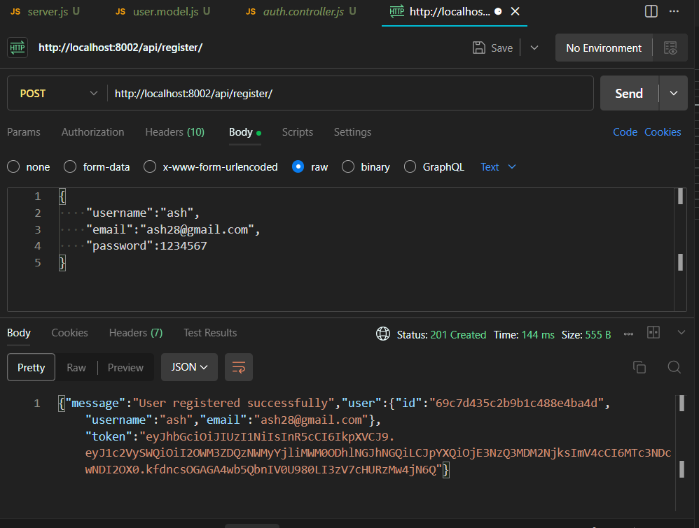

### User Login
- **POST /api/login** - Authenticate user and return JWT token
- Description: Validates user credentials and returns authentication token
- Screenshot:
  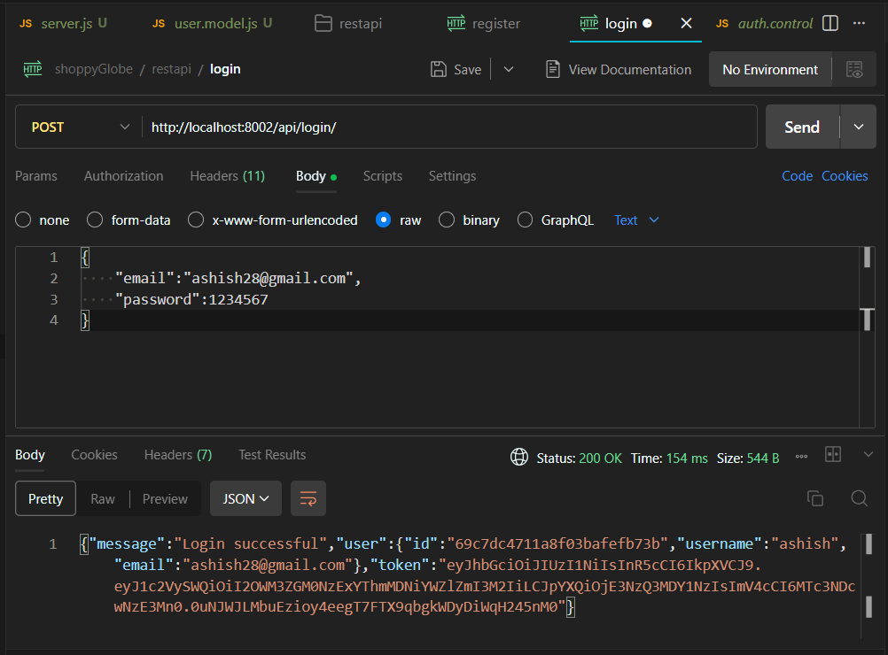

## Product Endpoints

### Get All Products
- **GET /api/products** - Fetch a list of all products from MongoDB
- Description: Returns array of all available products with their details
- Screenshot:
  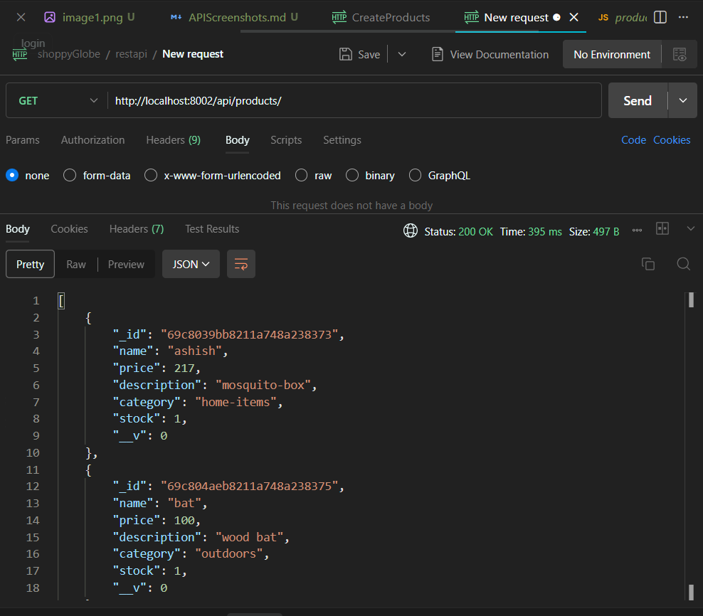

### Get Single Product
- **GET /api/products/:id** - Fetch details of a single product by its ID
- Description: Returns specific product information based on MongoDB ObjectId
- Screenshot:
  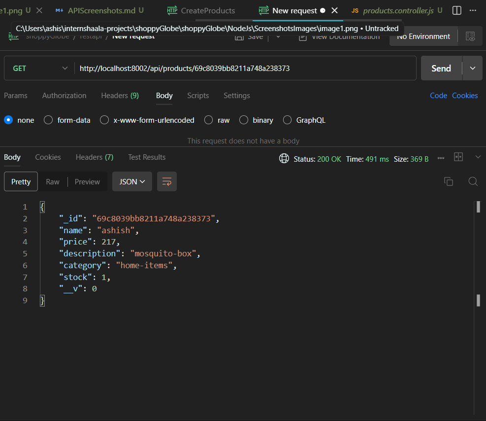

### Create Product
- **POST /api/products** - Create a new product in the database
- Description: Adds a new product with name, price, description, category, and stock
- Screenshot:
  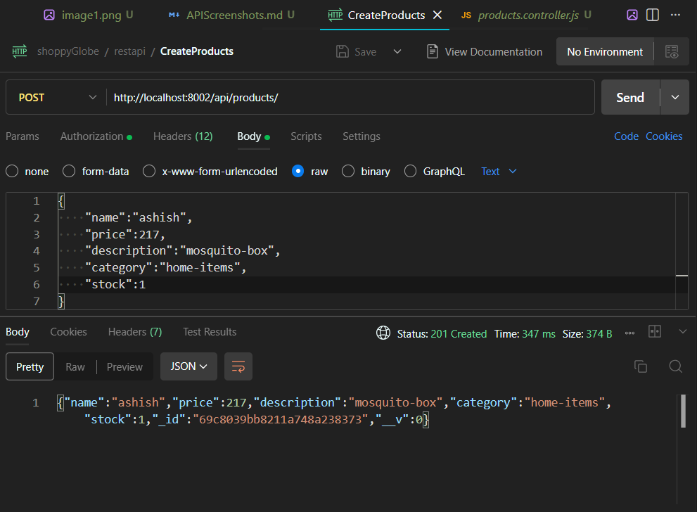

### Update Product
- **PUT /api/products/:id** - Update an existing product's information
- Description: Modifies product details based on provided ObjectId and update data
- Screenshot:
  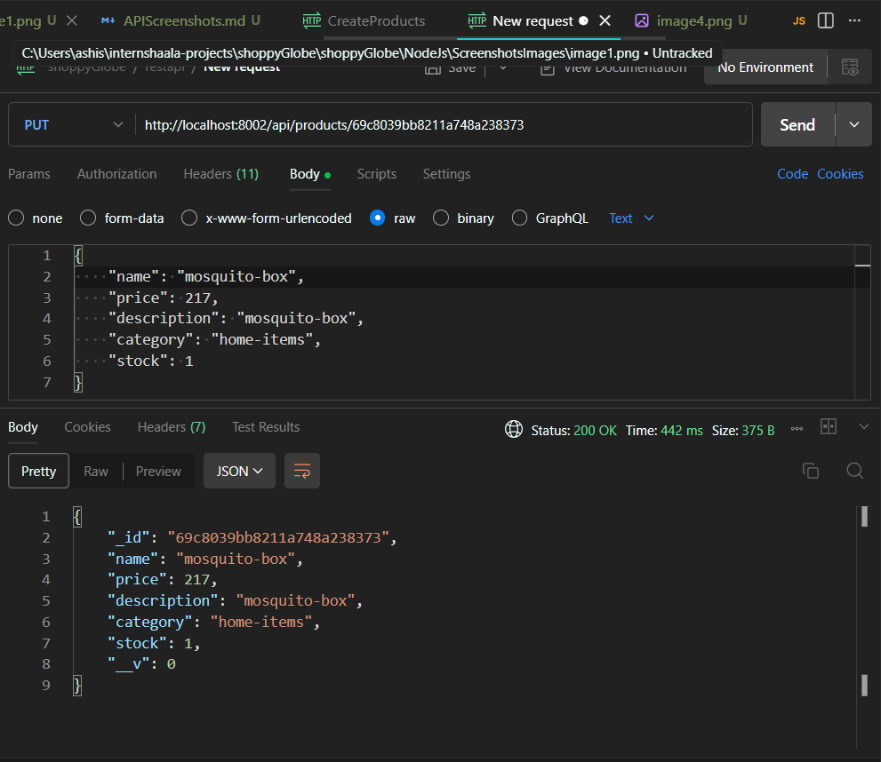

### Delete Product
- **DELETE /api/products/:id** - Remove a product from the database
- Description: Permanently deletes a product based on MongoDB ObjectId
- Screenshot:
  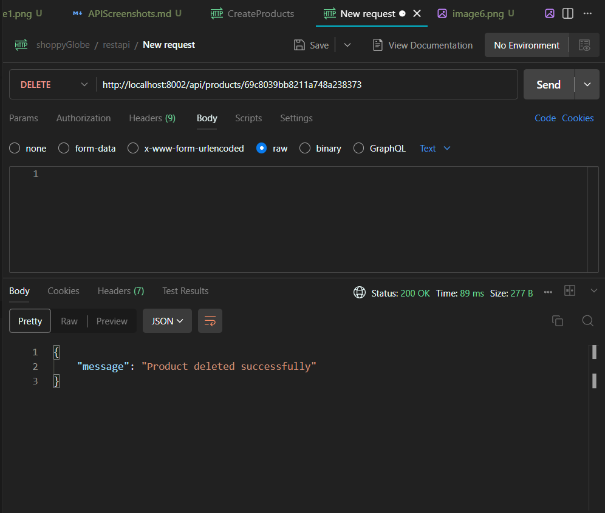

## Cart Endpoints (Protected)

### Get Cart Items
- **GET /api/cart** - Fetch all items in the user's shopping cart
- Description: Returns array of cart items with populated product details (requires JWT token)
- Screenshot:
  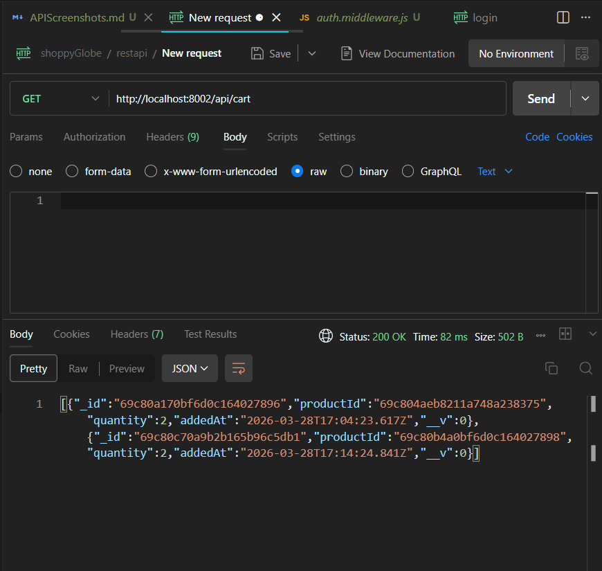

### Add to Cart
- **POST /api/cart** - Add a product to the shopping cart
- Description: Adds product to cart with specified quantity (requires JWT token)
- Screenshot:
  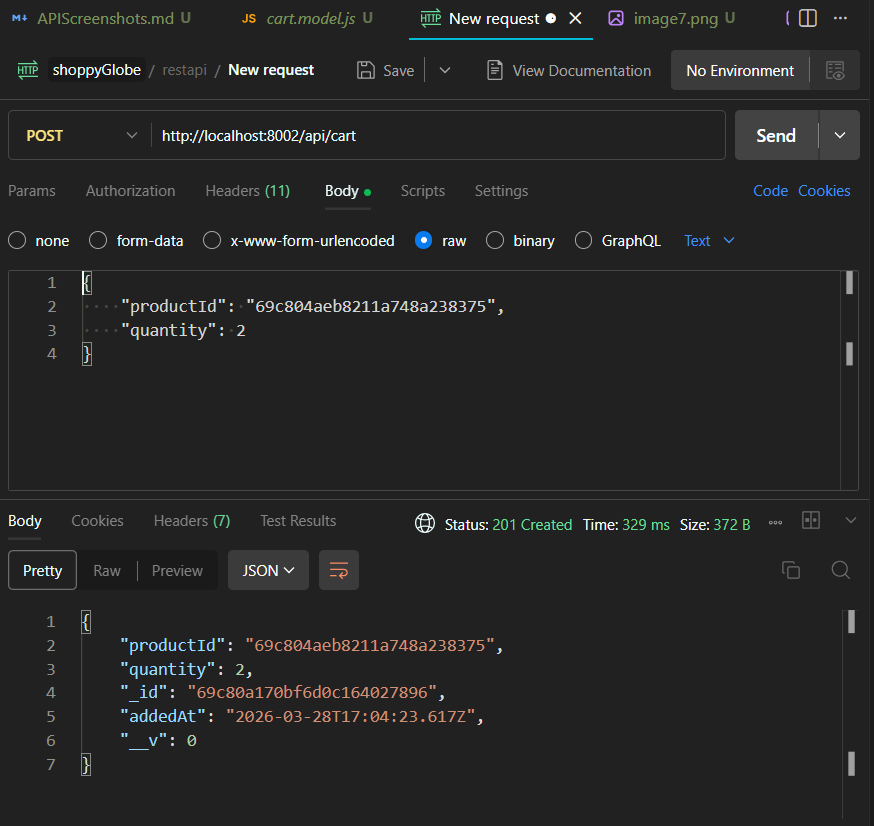

### Update Cart Item
- **PUT /api/cart/:id** - Update the quantity of a product in the cart
- Description: Modifies quantity of existing cart item (requires JWT token)
- Screenshot:
  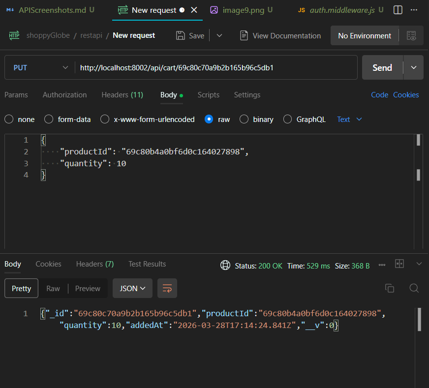

### Remove from Cart
- **DELETE /api/cart/:id** - Remove a product from the shopping cart
- Description: Deletes specific item from user's cart (requires JWT token)
- Screenshot:
  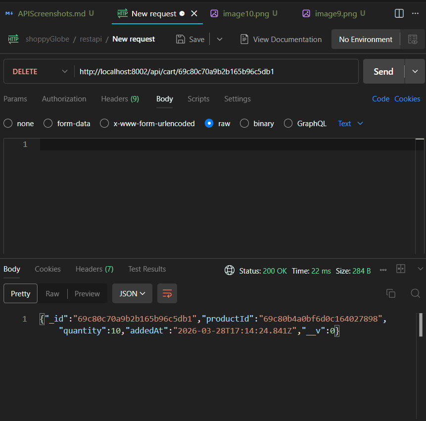

## Authentication Headers
For protected cart endpoints, include the following header:
```
Authorization: Bearer <JWT_TOKEN>
```

## Error Responses
All endpoints return appropriate error responses with status codes:
- 400: Validation errors
- 401: Authentication required
- 403: Invalid/expired token
- 404: Resource not found
- 500: Server errors

