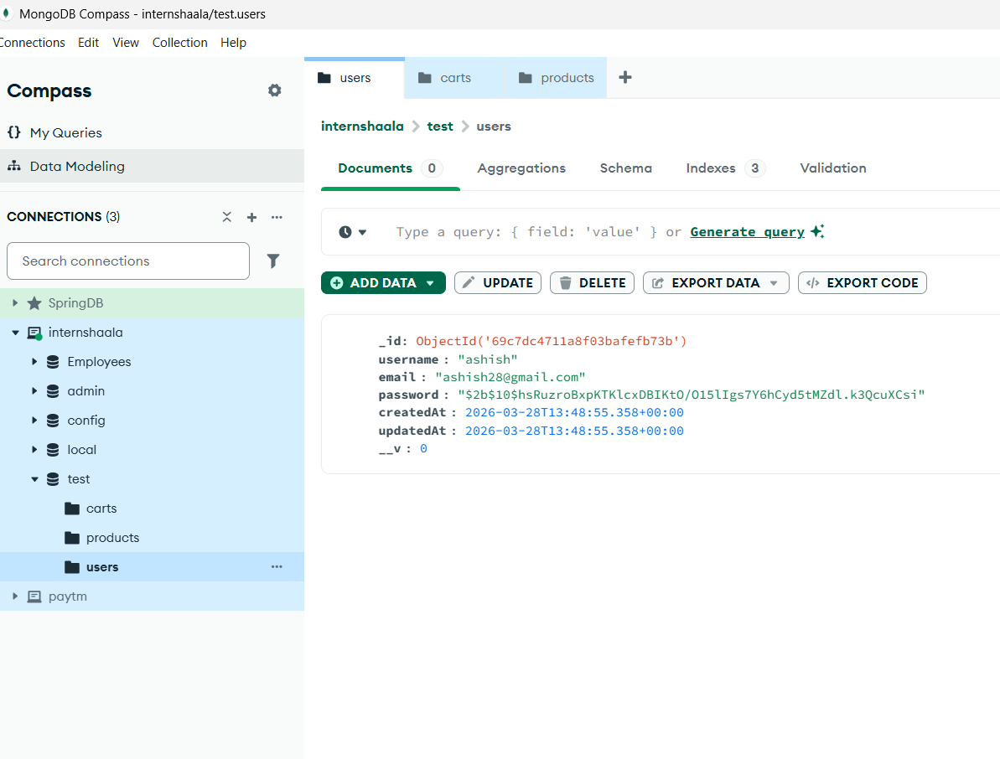
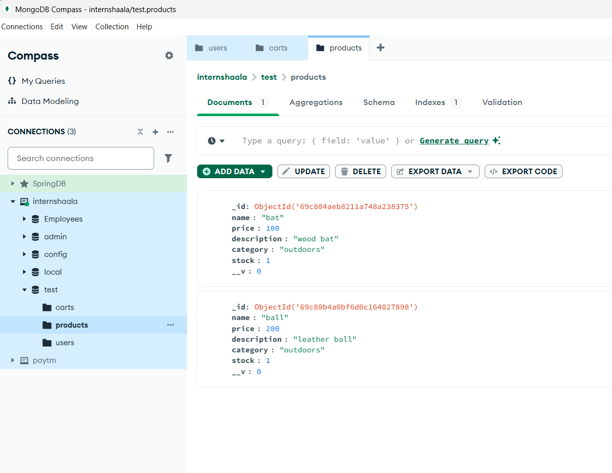
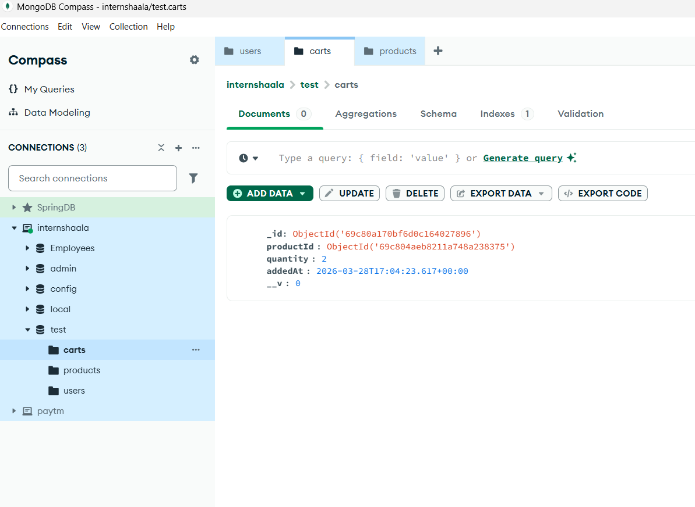

# MongoDB Database Screenshots

## Database Collections Overview

### Users Collection
- **Collection Name**: users
- **Description**: Stores user authentication data including usernames, emails, and hashed passwords
- **Schema Fields**:
  - username: String (unique, required)
  - email: String (unique, required, lowercase)
  - password: String (hashed, required)
  - createdAt: Date (auto-generated)
  - updatedAt: Date (auto-generated)
- Screenshot:
  

### Products Collection
- **Collection Name**: products
- **Description**: Stores product information for the e-commerce catalog
- **Schema Fields**:
  - name: String (required)
  - price: Number (required, non-negative)
  - description: String
  - category: String
  - stock: Number (non-negative)
  - createdAt: Date (auto-generated)
  - updatedAt: Date (auto-generated)
- Screenshot:
  

### Cart Collection
- **Collection Name**: carts
- **Description**: Stores shopping cart items linked to users and products
- **Schema Fields**:
  - productId: ObjectId (references products collection)
  - quantity: Number (positive integer, required)
  - addedAt: Date (auto-generated, default: current date)
  - createdAt: Date (auto-generated)
  - updatedAt: Date (auto-generated)
- Screenshot:
  

